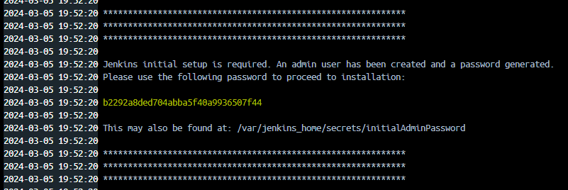

# backpack-calculator
A tool for estimating effective value of items for Backpack Battles. The value of an item is evaluated by calculating how much it affects a set of metrics per cost of that item.

# Contributing
## Generating documentation locally
```
pip install requirements.txt
sphinx-build -b html docs/ build/
start build\index.html
```

## Installing dependencies
```
pip install requirements.txt
```

## Running application
```
python -m src.main
```

## Testing application
```
python -m pytest
```

## Deploying Jenkins locally
### 1. Build docker image and run container
```
docker build -t backpack-calculator-image .
docker run --name backpack-calculator-container -p 50000:8080 backpack-calculator-image
```
### 2. Configure Jenkins
You will need to provide administrator password which can be seen in the console output or the container logs in Docker Desktop.



Complete the setup wizard installing the recommended plugins.

### 3. Create Multibranch Pipeline
Navigate the Jenkins dashboard by clicking  "*+New Item -> Multibranch Pipeline*". Follow Configuration wizard. Make sure to provide GitHub credentials when creating a branch source (use email address as Username and GitHub token as password).